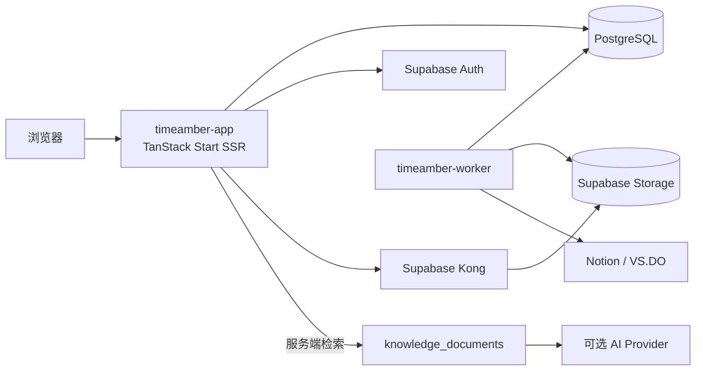

<div align="center">


# TimeAmber

**时光成珀，字字如初**

[](https://tanstack.com/start)
[](https://react.dev)
[](https://tailwindcss.com)
[](https://supabase.com)

</div>

TimeAmber 是部署在群晖 NAS 上的个人博客、剪藏归档和内容管理系统。项目使用
TanStack Start 构建前后台，数据、认证和媒体由自托管 Supabase 提供，独立 worker
负责 Notion、web-archive（VS.DO）、备份和定时任务。

生产站点：[timeamber.com](https://timeamber.com)

> 当前 `main` 分支同时包含公开站点、管理员后台和同步 worker 的生产代码。
> 公开端重点保持阅读路径短、首屏信息清晰；后台重点保持数据加载可见、搜索与切换不阻塞；
> 生产部署使用同一套 Docker Compose 项目运行，避免应用、worker 和自托管 Supabase 产生多套状态。

## 项目定位

TimeAmber 不是只展示文章的静态主题，而是一套围绕「写作、剪藏、归档、检索和维护」组织起来的
个人内容系统：

| 使用场景   | 入口                      | 说明                                                                   |
| ---------- | ------------------------- | ---------------------------------------------------------------------- |
| 公开阅读   | `/`、`/posts/:slug`       | 服务端渲染文章、分类、标签、归档和友链，支持亮暗主题与阅读辅助         |
| 内容管理   | `/admin`                  | 管理文章、分类、标签、媒体、设置、同步、备份、审计和诊断               |
| 内容导入   | `timeamber-worker`        | Notion 增量同步、VS.DO/web-archive 导入、历史索引补全和备份            |
| 站内问答   | `/admin/ask`、可选 `/ask` | PostgreSQL 检索私有内容，再调用服务端配置的 OpenAI-compatible Provider |
| 自托管运行 | Docker Compose + Supabase | 数据、认证、Storage、数据库和应用均可部署在 NAS 或单机服务器           |

项目的核心边界是：浏览器只拿到公开内容或当前会话允许的数据；服务端密钥、管理员会话、
同步令牌和 AI Provider Key 不进入前端构建产物。

## 功能

- **首页**：品牌 Hero（实时文章 / 标签 / 分类统计）→ 首篇文章编辑型主卡（16:7 封面）
  → 其余文章的 80×80 可选缩略图双列列表 → 页脚；服务端直出，保留紧凑阅读路径
- **响应式导航**：桌面端居中导航与搜索 / RSS / 后台 / 主题图标，移动端使用 300ms
  侧滑抽屉，包含完整导航、搜索、后台与主题切换
- 文章、归档、分类、标签、友链页
- **文章页阅读辅助**：面包屑、目录、阅读进度条、字号行高调节、代码复制、图片放大、
  图片懒加载、匿名点赞、分享、上一篇 / 下一篇、最多 6 篇相关文章
- **内容发现**：分类卡片使用琥珀 / 蓝 / 绿 / 橙 / 紫五色边条；友链使用带图标、简介与
  可选分组标签的 1 / 2 / 3 列响应式卡片
- **剪藏快照外壳**：`/cdn/` 下的离线 HTML 会在正文前插入本站标注条
  （品牌入口、剪藏日期、原文外链、"样式未改动"说明）与右下角返回胶囊，
  见 `server/clip-shell.mjs`
- **服务端 Markdown 渲染**：GFM（表格、任务列表、脚注）+ Shiki 语法高亮 + rehype-sanitize，
  代码块外框与复制按钮由服务端直出，客户端只做事件委托与图片放大
- **⌘K / Ctrl+K 全站搜索**：一次命中文章、分类与标签
- **后台体验**：全局文章 / 标签 / 分类搜索、琥珀侧栏选中态、引导式空状态、明确的红色
  危险操作，以及已有的键盘导航快捷键
- **分类页** `/categories`：按文章数排序的分类卡片与标签云，支持 `?c=` / `?tag=` 筛选
- **归档按年折叠**，避免上千篇文章一次铺开
- **sitemap.xml 与 RSS**：sitemap 覆盖全部已发布文章（带 lastmod），RSS 输出最新 50 篇
- **SEO head**：canonical、Open Graph、Twitter Card、`article:published_time`，
  描述统一去除 Markdown 语法
- Supabase Auth 管理员登录与 HttpOnly 加密会话
- Markdown 文章和 HTML 跳转文章
- Notion 数据源增量导入与图片修复
- NAS web-archive / VS.DO 增量导入
- Supabase Storage 媒体库、同源媒体代理和上传
- 自动备份、保留策略、通知、运行诊断和审计记录
- PostgreSQL advisory lock，防止自动任务与手动任务并发写入
- 自定义品牌图、favicon、默认文章首图和本地字体

## 架构

```text
Internet
  |
  v
timeamber.com
  |
  v
timeamber-app :49287
  |-- TanStack Start SSR / Admin
  |-- /supabase/storage/... -> Supabase Kong
  |
  +--> timeamber-worker :3001
  |      |-- Notion sync
  |      |-- web-archive sync
  |      `-- backup jobs
  |
  `--> Supabase
         |-- PostgreSQL
         |-- Auth
         |-- PostgREST
         |-- Storage
         |-- Realtime
         |-- Studio
         `-- Kong
```

NAS 项目目录：

```text
/opt/docker/timeamber
```

应用容器与 Supabase 使用同一个 Compose 项目和网络。生产应用映射
`49287:3000`，Supabase API 只绑定本机地址，不应直接暴露到公网。

生产服务边界：

| 服务                    | 容器端口     | 作用                                               | 公网策略                                         |
| ----------------------- | ------------ | -------------------------------------------------- | ------------------------------------------------ |
| `timeamber-app`         | `3000`       | TanStack Start SSR、静态资源、后台和媒体代理       | 只通过反向代理/隧道对外，主机映射为 `49287:3000` |
| `timeamber-worker`      | `3001`       | Notion、web-archive、知识索引和备份任务            | 不直接发布到公网，仅由 app 在 Compose 网络内调用 |
| `supabase-kong`         | `8000/8443`  | Auth、REST、Storage、Realtime 等 Supabase API 网关 | 绑定内部地址；公网访问应经过受控代理             |
| `supabase-db`           | `5432`       | PostgreSQL 数据库                                  | 仅 Compose 网络内访问                            |
| `timeamber-migrate`     | —            | `tools` profile 下执行迁移或恢复                   | 一次性工具，不作为常驻服务                       |
| `timeamber-cloudflared` | host network | 可选 Cloudflare Tunnel 出口                        | 只读取 tunnel 配置，不承载应用数据               |

### 请求与数据流



- 公开文章、归档、分类和标签主要由 `timeamber-app` 直接从 PostgreSQL 读取并服务端渲染。
- 管理员登录通过 Supabase Auth 完成，TimeAmber 服务端再建立 HttpOnly 会话；管理操作不会把
  service role key 下发给浏览器。
- 媒体统一走 `/supabase/storage/...` 的同源代理路径。应用只需要访问内部 Kong，浏览器不需要
  连接 NAS 上的旧媒体目录。
- worker 通过数据库和 Storage 写入导入结果，`sync_runs`、审计和诊断表为后台提供可追踪状态。
- Ask TimeAmber 先在 PostgreSQL 的 `knowledge_documents` 上检索，再由服务端调用 AI Provider；
  AI Key 不参与浏览器构建，也不写入静态 HTML。

## 性能与交互策略

最近的前后台整理围绕两个实际问题展开：打开文章时尽量提前准备路由资源，进入后台时避免把
所有数据和搜索计算集中在一次同步渲染中。相关代码仍保持在页面组件和共享数据层内，方便继续
定位与回归：

| 区域     | 当前策略                                                                         | 维护提示                                                           |
| -------- | -------------------------------------------------------------------------------- | ------------------------------------------------------------------ |
| 首页     | 第一篇文章使用编辑型主卡，其余文章保持紧凑列表；缩略图按需加载                   | 修改行高、封面比例或首屏间距时，要同步检查不同视口高度             |
| 文章跳转 | 文章卡、归档和相关文章使用 TanStack Router 的 intent preload                     | 新增文章入口时优先复用同一 preload 行为                            |
| 首页动效 | 只给主卡和首屏少量文章添加渐入延迟；非首屏条目不参与大规模动画                   | 新增动画应遵守 `prefers-reduced-motion`                            |
| 全站搜索 | 管理端搜索使用延迟查询值和预计算的文章检索索引                                   | 不要在每次按键时重新拼接全部文章标题、分类和标签                   |
| 后台状态 | 文章、分类、标签等状态分块加载，首屏先展示可用骨架与局部状态，较重数据在后台补齐 | 新增管理页应使用共享 admin store，避免重复拉取同一份全量数据       |
| Markdown | 服务端完成 GFM、Shiki 高亮和 sanitize，客户端只接管复制、图片放大等交互          | 不要把私有文章正文预打包到客户端静态资源                           |
| 静态资源 | `server/node.mjs` 对构建资源提供 immutable 缓存，并对可压缩响应支持 gzip         | 发布后若页面未变化，先确认浏览器和反向代理缓存，再判断是否构建失败 |

这部分优化的目标是降低点击文章和进入后台时的主线程压力，同时不牺牲服务端直出、键盘操作、
移动端可用性和无障碍的降运动偏好。

## 目录

```text
src/                         TanStack Start 前后台
src/lib/markdown.server.ts   服务端 Markdown 管线（GFM + Shiki + sanitize + 代码块外框）
src/lib/home.functions.ts    首页取数（最新文章、缩略图与实时文章 / 标签 / 分类统计）
src/components/home/         首页区块：文章列表与文章行
src/components/layout/       顶栏、页脚、面包屑、回到顶部、搜索面板、主题切换
src/components/post/         文章页目录与阅读设置
src/lib/feeds.server.ts      sitemap.xml / rss.xml 生成
src/lib/strip-markdown.ts    meta description 与 RSS 共用的去语法工具
server/                      Node 生产入口、静态资源和媒体代理
server/clip-shell.mjs        /cdn/ 剪藏快照的本站外壳（流式注入，不改快照文件）
src/lib/sync-admin.functions.ts   后台同步中心取数：三来源状态、Notion 授权探测、数据源增删
src/routes/_authenticated/admin/sync.tsx  后台「内容同步」页面
worker/                      Notion、web-archive、备份任务
worker/notion-sync.ts        Notion 增量同步与正文回填（含限速、退避、多数据源游标）
worker/archive-sync.ts       web-archive 离线 HTML 抓取
supabase/migrations/         数据库结构、RLS 和 Storage 策略
deploy/supabase/             Supabase + TimeAmber Compose
public/brand/                Logo、favicon、PWA 图标和默认首图
public/fonts/                本地字体
Dockerfile                   Web 应用镜像
Dockerfile.worker            Worker 镜像
```

## 视觉系统与主题

TimeAmber 使用 Tailwind CSS v4 的语义 token 统一控制前后台视觉。所有主题颜色都定义在
`src/styles.css` 的 `:root` 与 `.dark` 中，再通过 `@theme inline` 映射到
`bg-background`、`text-foreground`、`border-border` 等工具类。组件不保存独立主题色，
因此换色不会改变路由、内容、数据或交互逻辑。

### 主题切换

站点支持亮色和暗色两种固定偏好：

| 偏好                                                                                 | 根元素状态             | 行为                           |
| ------------------------------------------------------------------------------------ | ---------------------- | ------------------------------ |
| 亮色                                                                                 | `<html class="light">` | 固定使用暖纸主题               |
| 暗色                                                                                 | `<html class="dark">`  | 固定使用暖黑主题，也是默认偏好 |
| 偏好同时写入 `ta-theme` Cookie 和浏览器本地存储。首屏 bootstrap 脚本在样式表与 React |
| 水合前设置 `.light`/`.dark`，避免主题闪烁；切换机制集中在 `src/lib/theme.ts` 与      |
| `src/components/layout/ThemeToggle.tsx`，修改视觉 token 时不应改动它们。             |

### Editorial token

当前主题采用暖纸、暖调真黑、近黑油墨和单一蓝色强调的 editorial 视觉系统：

| Token                  | 亮色                                     | 暗色                                     |
| ---------------------- | ---------------------------------------- | ---------------------------------------- |
| `--background`         | `oklch(0.962 0.006 95)`                  | `oklch(0.18 0.008 95)`                   |
| `--foreground`         | `oklch(0.18 0.008 95)`                   | `oklch(0.94 0.006 95)`                   |
| `--card` / `--popover` | `oklch(0.985 0.004 95)`                  | `oklch(0.23 0.008 95)`                   |
| `--primary`            | `oklch(0.485 0.272 266)`（约 `#1d39f5`） | `oklch(0.621 0.204 273)`（约 `#6175ff`） |
| `--border`             | 暖中性 16% 发丝线                        | 暖白 17% 发丝线                          |
| `--input`              | 暖中性 28%                               | 暖白 30%                                 |
| `--ring`               | 主蓝 55%                                 | 主蓝 60%                                 |

- 全局 `--radius: 0`，普通卡片、按钮、输入框和代码块保持编辑型直角；正文图片按阅读场景
  单独增加 0.5rem 圆角与轻阴影。
- 正文与标题优先使用 Geist / Manrope，并提供 Noto Sans CJK SC、思源黑体和系统中文字体回退。
- 品牌字继续使用 `A Song For Jennifer`；代码继续使用本地 `JetBrains Mono`。
- 正文标题使用 650 字重，h1/h2/h3 行高分别为 1.05、1.10、1.15。
- 边框保持 1px 实线；彩色主色只用于链接、交互状态、焦点环和少量强调。
- 标签胶囊、头像、状态点等明确使用 `rounded-full` 的元素仍保持圆形，不受 `--radius` 影响。

### 琥珀点缀色

蓝色是唯一主色，琥珀只作点缀出现，用来呼应「时光琥珀」的名字而不与主色争夺注意力：

| Token                       | 亮色                   | 暗色                  |
| --------------------------- | ---------------------- | --------------------- |
| `--accent-amber`            | `oklch(0.52 0.13 68)`  | `oklch(0.8 0.14 72)`  |
| `--accent-amber-strong`     | `oklch(0.45 0.14 62)`  | `oklch(0.86 0.15 75)` |
| `--accent-amber-soft`       | 同色 12% 底            | 同色 16% 底           |
| `--accent-amber-foreground` | `oklch(0.99 0.005 95)` | `oklch(0.16 0.01 95)` |

出现的位置包括：首页 Hero 光晕与统计、文章分类胶囊、阅读进度条、目录当前项、归档热力条、
正文引用与行内代码、友链悬停、后台侧栏选中态，以及深色页面顶部 5% 透明度的背景光晕。
亮色档必须压到 `L=0.52` 才够 4.5:1，不要把暗色档那支亮琥珀直接搬过去。新增用途时
先在 `:root`/`.dark` 补语义变量，再在 `@theme inline` 映射，组件里只写类名。

### 文章列表密度

首页文章行呈现 80×80 可选缩略图、标题、分类与发布日期，不加载摘要或阅读时长。
服务端固定下发最新 18 篇，桌面按视口高度显示其中 2–14 篇，移动端完整显示；分类筛选
结果按 60 篇分页加载；文章详情页最多显示 6 篇相关文章。标题最多两行，日期固定按上海
时区单行显示，避免服务端渲染与浏览器水合结果不一致。

分类与日期竖排收在行的右侧而非标题下方：首页靠 `.home-list` 的视口高度断点精确填满
一屏，任何让行变高的改动（例如调整缩略图尺寸或把摘要加回列表）都会连带需要重调断点，
动手前先看 `src/components/home/ArticleSection.tsx` 顶部的说明。

### 对比度

下列组合按 WCAG 2.1 相对亮度公式核验：

| 组合                | 亮色    | 暗色    | 结果     |
| ------------------- | ------- | ------- | -------- |
| 正文 / 背景         | 16.84:1 | 15.77:1 | AAA      |
| 次要文字 / 背景     | 6.66:1  | 7.59:1  | AA / AAA |
| 主蓝链接 / 背景     | 6.37:1  | 4.92:1  | AA       |
| 主色按钮文字 / 主色 | 6.72:1  | 5.14:1  | AA       |

如需恢复 TimeAmber 原青色品牌，只还原 `--primary*`、`--accent*`、`--ring` 和
`--brand-1/2/3` 即可；建议亮色主色约为 `oklch(0.50 0.14 200)`，暗色约为
`oklch(0.72 0.13 195)`，并重新运行对比度与亮暗主题截图检查。

## 本地验证

要求 Node.js 22 和 npm。

```bash
npm ci
npm test
npx tsc --noEmit
npm run lint
npm run build
```

### 优化与发布前验证

优化验证脚本会把浏览器、资源、SEO、性能预算、站点地图和失败归因写入本地
`reports/opt/`，默认不修改生产数据。发布前至少对公开页面运行一次完整验证，并把报告
中的 FAIL 项处理完；生产站点的旧数据问题不能用“代码已构建”代替验收。

```bash
# 公开页面：浏览器、资源、Schema、sitemap、robots 和性能预算
npm run opt:verify -- \
  --label pre-release \
  --base-url https://timeamber.com \
  --page 首页,文章页,归档页,分类页

# 只读扫描已有缩略图；input 的格式以脚本和当前媒体清单为准
npm run opt:scan-thumbs -- --input path/to/media-inventory.json
```

媒体派生脚本默认是 dry-run。它按照 `scripts/opt/image.config.json` 生成 320/640/960/1280/1920
宽度的 AVIF/WebP 候选，且只写入派生路径；原图默认只读。只有完成快照、确认报告没有负优化，
并在明确的存储根目录或 Supabase service-role 适配器上执行时，才可以加 `--apply`：

```bash
# 先生成队列和报告，不写媒体存储
npm run opt:gen-images -- \
  --input path/to/media-inventory.json \
  --label pre-release-images

# 经过人工确认后才应用；必须显式提供真实存储适配器
npm run opt:gen-images -- \
  --input path/to/media-inventory.json \
  --root /path/to/media-root \
  --apply \
  --label release-images

# 中断后继续，或只重试失败项
npm run opt:gen-images -- --resume --queue reports/opt/images/queue.json
npm run opt:gen-images -- --only-failed --queue reports/opt/images/queue.json
```

`opt:fix-thumbs` 也遵循同样的 dry-run 优先原则；缩略图修复必须先做只读扫描，确认原图
哈希在写入前后保持一致，并对写入后的派生文件进行抽检。`reports/` 是本机验证证据，
默认不提交到仓库，也不得把其中的 token、Cookie、service key 或本机绝对路径发布到 GitHub。

开发模式：

```bash
npm run dev
```

常用脚本：

| 命令               | 用途                                                 |
| ------------------ | ---------------------------------------------------- |
| `npm run dev`      | 启动 Vite 开发服务器                                 |
| `npm run build`    | 生成生产端 `dist/client` 与 `dist/server`            |
| `npm run start`    | 使用 `server/node.mjs` 启动生产 Node 入口            |
| `npm run worker`   | 直接运行 `worker/index.ts`，用于本地调试 worker      |
| `npm test`         | 运行 `tests/*.test.ts`                               |
| `npm run lint`     | 执行 ESLint                                          |
| `npx tsc --noEmit` | 只做 TypeScript 类型检查                             |
| `npm run format`   | 使用 Prettier 格式化项目文件；执行前先确认工作区变更 |

本地开发需要可访问的 Supabase 实例。浏览器侧使用 `VITE_SUPABASE_URL` 与
`VITE_SUPABASE_PUBLISHABLE_KEY`，服务端和生产容器使用对应的
`SUPABASE_URL`、`SUPABASE_PUBLISHABLE_KEY`、`SUPABASE_SERVICE_ROLE_KEY` 与
`DATABASE_URL`。其中 `VITE_` 变量会进入浏览器构建，只能放公开地址和 publishable/anon key，
不能放 service role key、数据库密码、会话密钥或第三方令牌。

## 环境配置

复制示例文件后填写实际值，不要提交 `.env`。

```bash
cd deploy/supabase
cp .env.example .env
```

关键配置：

| 变量                         | 用途                                                                        |
| ---------------------------- | --------------------------------------------------------------------------- |
| `POSTGRES_PASSWORD`          | Supabase PostgreSQL 密码                                                    |
| `JWT_SECRET`                 | Supabase JWT 密钥                                                           |
| `ANON_KEY`                   | 浏览器和匿名 API 密钥                                                       |
| `SERVICE_ROLE_KEY`           | 服务端管理密钥                                                              |
| `SESSION_SECRET`             | TimeAmber HttpOnly 会话加密                                                 |
| `TIMEAMBER_SECRET_KEY`       | 第三方配置加密                                                              |
| `WORKER_SECRET`              | App 调用 worker 的内部鉴权                                                  |
| `SUPABASE_PUBLIC_URL`        | 公开 Supabase 基础地址                                                      |
| `LEGACY_MEDIA_PATH`          | NAS 历史媒体目录                                                            |
| `NOTION_TOKEN`               | Notion 集成令牌                                                             |
| `NOTION_DATA_SOURCE_ID`      | Notion 数据源 ID                                                            |
| `VS_DO_BASE_URL`             | web-archive 服务地址                                                        |
| `VS_DO_TOKEN`                | web-archive API 令牌                                                        |
| `AI_BASE_URL`                | OpenAI-compatible API 基础地址（可填写 `/v1` 或完整 Chat Completions 地址） |
| `AI_API_KEY`                 | Ask TimeAmber 服务端 API Key                                                |
| `AI_MODEL`                   | Ask TimeAmber 使用的模型名称                                                |
| `KNOWLEDGE_INDEX_BATCH_SIZE` | worker 每批补全 web-archive 知识索引的数量，默认 100                        |

`AI_API_KEY` 只注入 `timeamber-app` 的运行时环境，不是 Docker build arg，也不能使用
`VITE_` 前缀。未配置 AI Provider 时，Ask TimeAmber 会显示未配置状态，站点其他功能继续正常运行。

### 运行时配置边界

生产 Compose 会把同一组 `.env` 变量转换为不同容器需要的运行时变量：

| 运行面             | 主要变量                                                                                        | 说明                                                 |
| ------------------ | ----------------------------------------------------------------------------------------------- | ---------------------------------------------------- |
| 浏览器构建         | `VITE_SUPABASE_URL`、`VITE_SUPABASE_PUBLISHABLE_KEY`                                            | 只包含公开 Supabase 地址和 publishable/anon key      |
| `timeamber-app`    | `PORT`、`DATABASE_URL`、`SUPABASE_URL`、`SUPABASE_PUBLISHABLE_KEY`、`SUPABASE_SERVICE_ROLE_KEY` | SSR、数据库读取、Auth 会话、Storage 代理和管理员操作 |
| `timeamber-app`    | `SESSION_SECRET`、`TIMEAMBER_SECRET_KEY`、`WORKER_URL`、`WORKER_SECRET`                         | 会话加密、第三方配置加密和 app-worker 内部鉴权       |
| `timeamber-worker` | `DATABASE_URL`、`MEDIA_ROOT`、`BACKUP_ROOT`、`BACKUP_ENABLED`、`BACKUP_RETENTION`               | 数据同步、媒体文件和备份保留策略                     |
| `timeamber-worker` | `SYNC_ENABLED`、`NOTION_*`、`VS_DO_*`、`KNOWLEDGE_INDEX_BATCH_SIZE`                             | 导入任务和知识索引补全；未配置来源时相应任务不应启用 |
| Supabase 服务      | `POSTGRES_*`、`JWT_*`、`ANON_KEY`、`SERVICE_ROLE_KEY`                                           | 数据库、Auth、API Gateway 和 Storage 的底层配置      |

根目录生产 Compose 使用 `ANON_KEY` 给应用映射成
`SUPABASE_PUBLISHABLE_KEY`；模块化模板也遵循同一约定。修改环境变量名时，必须同时检查
`docker-compose.yml`、`deploy/supabase/docker-compose.timeamber.yml`、Dockerfile 的 build args
以及 `src/integrations/supabase/client.ts`，否则可能出现“服务端正常、浏览器端缺少 Supabase 配置”的
分裂状态。

## Ask TimeAmber

Ask TimeAmber 位于管理员后台 `/admin/ask`，复用现有 Supabase Auth 与 HttpOnly 管理员会话。
它不会把私人正文写入客户端静态文件；浏览器只收到最终回答和有限的来源摘要。

### 前台开放（默认关闭）

前台 `/ask` 提供同一套问答能力，但**默认不对外**，开关在 `/admin/settings` 的「前台功能」区块
（`settings.askPublicEnabled`）。关闭时前台页面只显示「站内问答暂未开放」，导航里也不会出现入口。

开放后每次提问都会消耗所配置的 `AI_API_KEY`，因此内置了成本闸门：

- 全站维度限流：每分钟 6 次、每天 300 次（给成本一个硬上限）。
- 问题长度 2–1000 字。
- 检索与作答逻辑与后台版完全一致，没有足够资料时同样不会编造。

之所以是全站限流而不是按 IP：站点部署在反向代理/隧道之后，转发头可伪造，
与其做一个能被绕过的按 IP 限流，不如把全局闸门收紧。

检索层继续使用现有 PostgreSQL：

- `simple` Full Text Search 与 `pg_trgm` 混合排序，不引入额外向量数据库。
- `public.knowledge_documents` 开启 RLS，仅管理员可读取。
- 博客文章和 Notion 内容由 `posts` 触发器增量更新索引。
- web-archive 同步时从离线 HTML 提取可读正文并增量写入索引。
- `knowledge-index` worker 任务只补全缺失的历史归档，不会在每次启动时全量重建。

应用新 migration 后，可在 Ask TimeAmber 页面补全历史归档，或通过受 `WORKER_SECRET`
保护的 worker 入口运行 `knowledge-index` 任务。所有回答的 Sources 都来自实际检索结果；没有足够
资料时不会调用模型编造答案。

管理员密码通过 Supabase Auth 管理，不写入仓库或 Compose 文件。

## 代码提交与发布

建议把代码变更、部署配置和运行时数据分开处理。提交前至少执行：

```bash
git status --short
git diff --check
npm test
npx tsc --noEmit
npm run lint
npm run build
```

提交时只加入本次明确验证过的文件：

```bash
git add README.md src/ worker/ server/ scripts/opt/ Dockerfile Dockerfile.worker
git diff --cached --stat
git diff --cached --check
git commit -m "describe the change"
git push origin <reviewed-branch>
```

面向生产的变更建议先推送到独立审核分支，再合并到 `main`；不要从生产机直接提交，
也不要用强制推送覆盖远端历史。合并前需要保留可回滚的提交号和对应的验证报告。

不要因为发布应用而顺手提交以下内容：

- `.env`、`deploy/supabase/.env`、Cloudflare tunnel 凭据、Notion/VS.DO/AI/GitHub token；
- PostgreSQL dump、媒体库、`deploy/supabase/volumes/*` 中的数据库和运行时数据；
- 带有本机绝对路径、临时迁移目录或 NAS 专用端口的 Compose 覆盖文件；
- 与本次代码无关的备份、构建日志和生产机工作区改动。

如果应用是由生产机上的 Git 工作区管理，先在本地完成检查并推送，再在生产机执行
`git pull --ff-only`。生产机存在未提交变更时应先保存差异和当前提交号，不要用强制覆盖的方式
同步仓库。

## NAS 部署

生产目录为 `/opt/docker/timeamber`。发布前先确认工作区没有会被覆盖的本地改动，
保存当前提交号，并备份源码与数据库。生产机如果通过 Git 管理源码，应使用
`git pull --ff-only` 更新已审核的发布分支；如果使用发布包，则只替换受版本控制的源码，
保留 `.env`、`deploy/supabase/.env`、媒体、备份和数据库卷。

### 增量发布清单

应用发布前按下面顺序执行，任何一步失败都停在当前版本，不要删除容器、数据库卷或媒体：

1. 记录当前提交号，保存生产工作区差异，并备份源码、数据库和关键运行时数据。
2. 只更新已审核的提交或发布分支，使用 `git pull --ff-only`，确认没有意外的本地改动。
3. 执行 `docker compose --env-file .env -f docker-compose.yml config --quiet`，确认 Compose
   展开配置有效且 `.env` 没有被覆盖。
4. 仅重建发生变化的服务；普通 Web 变更只重建 `timeamber-app`，不要顺手重启 worker、
   Supabase 或 Cloudflare tunnel。
5. 通过本机入口、反向代理入口和浏览器冒烟检查后，再把发布提交号记录到部署日志。

若验收失败，先保留失败日志和当前镜像，再回到发布前记录的旧提交重新构建 `timeamber-app`
并执行相同的健康检查。回滚只切换受版本控制的源码或镜像，不删除数据库卷、媒体卷、备份
和 `.env`；migration 的回滚必须另行评估，不能把应用回滚误当成数据库回滚。

发布前检查：

```bash
cd /opt/docker/timeamber
git status --short
git rev-parse HEAD
```

纯 CSS、前端或服务端 Web 改动只需要重建 `timeamber-app`，不要重启 worker 或 Supabase：

```bash
cd /opt/docker/timeamber

docker compose \
  --env-file .env \
  -f docker-compose.yml \
  build timeamber-app

docker compose \
  --env-file .env \
  -f docker-compose.yml \
  up -d --no-deps timeamber-app
```

当前生产容器的 Compose working directory 和 config file 分别是
`/opt/docker/timeamber` 与根目录 `docker-compose.yml`；增量发布必须沿用这一项目，
避免创建第二套同名容器。`deploy/supabase/docker-compose*.yml` 是模块化的新环境部署模板，
不用于替换已运行的根 Compose 项目。

只有 `worker/`、`Dockerfile.worker` 或 worker 依赖发生变化时，才追加构建和更新
`timeamber-worker`。数据库 migration 必须使用下文独立的 tools profile，不能通过普通
Web 发布隐式执行。

查看状态：

```bash
docker ps --filter name=timeamber
docker inspect --format '{{.State.Health.Status}}' timeamber-app
docker logs --tail 100 timeamber-app
curl --fail --show-error --head http://127.0.0.1:49287/
curl --fail --show-error --head https://timeamber.com/
```

生产验收至少覆盖：首页和一篇文章、亮暗主题切换、移动端首屏、阅读字号控制、浏览器
console，以及静态资源是否来自新构建。容器状态必须为 `healthy`，公网与本机入口都应返回
2xx。两个生产容器都配置了健康检查和 `restart: unless-stopped`。

## 数据库初始化

首次部署时运行迁移：

```bash
cd /opt/docker/timeamber

docker compose \
  --env-file .env \
  -f docker-compose.yml \
  --profile tools run --rm timeamber-migrate
```

迁移会创建文章、分类、标签、匿名互动、媒体、同步记录、配置、审计、通知和诊断表，
并启用 RLS。写入操作只允许管理员或 service role。

## 内容同步

文章有三个自动来源，都由 `timeamber-worker` 驱动（`SYNC_ENABLED=true`）：

| 来源 | 类型 | 说明 |
| --- | --- | --- |
| Notion · **Link** | `post_type='markdown'` | 主力剪藏库，正文以 Markdown 存进 `posts.content` |
| Notion · **SmartClip** | `post_type='markdown'` | 第二个 Notion 库，同上 |
| **web-archive** | `post_type='html'` | NAS 上抓的离线 HTML，`external_url` 指向 `/cdn/...`，文章页整页跳转过去 |

后台入口：**`/admin/sync`（侧边栏「内容同步」）**。三个来源的状态、进度、手动触发、
Notion 授权与数据源管理都在这一页，不必再去翻 worker 日志。

### 调度

`worker/index.ts` 的 `tick()` 每分钟检查一次，按分钟数触发：

| 任务 | 频率 | 作用 |
| --- | --- | --- |
| `notion` | 每 10 分钟（`minute % 10 === 0`） | 增量同步：按游标拉新页面、更新元数据 |
| `notion-repair` | 每 10 分钟（`minute % 10 === 5`） | 回填正文：只处理正文为空/是链接壳的文章 |
| `archive` | 每 20 分钟（`minute % 20 === 5`） | web-archive 分页抓取，`source + source_id` 去重 |
| `knowledge-index` | 每 20 分钟（`minute % 20 === 18`） | 重建 Ask TimeAmber 的知识索引 |
| `backup` | 每天 03:30（上海时区） | `pg_dump` 全库备份 |

所有任务写入 `public.sync_runs`；advisory lock 防止同名任务并发。看到
`already running` 说明手动触发与定时任务重叠，锁挡住了重复写入，等当前任务结束即可。

### Notion：database id 不等于 data source id

**这是配置 Notion 同步最容易出错的地方。** 从浏览器地址栏复制的链接长这样：

```text
https://cangshu.notion.site/31437041b78c81f7b936fcac6ba2f06a?v=...
                            └─ 这是 database id，不是同步要用的 id ─┘
```

同步走的是 Notion 的 `/data_sources/{id}/query` 端点，需要的是该 database **下面**的
data source id，两者是不同的 UUID。直接把链接里的 id 填进配置，查询时只会得到
`404 object_not_found`。

换算方式（后台「粘贴 Notion 数据库链接来添加数据源」会自动做这一步）：

```bash
curl -s -H "Authorization: Bearer $NOTION_TOKEN" \
     -H "Notion-Version: 2026-03-11" \
     "https://api.notion.com/v1/databases/<database-id>" | jq .data_sources
```

配置项 `settings.notion_data_source_id` 存的是逗号分隔的 **data source id** 列表。

另外，令牌有效 ≠ 每个库都能访问：Notion 集成必须在每个库上被单独「连接」。后台的
**测试授权**按钮会逐库探测并显示授权状态与条目数 —— 这正是排查 404 的第一步。

### 正文回填与节流参数

Notion 同步分两步：增量同步先写入元数据，正文由 `notion-repair` 分批补。判断依据是
`isLinkShellContent()`（正文短于 260 字符，或短于 900 字符且含「原文地址」）。

这套流程最初跑在 Cloudflare Workers 上，受制于它的子请求配额，几个上限被写死成很小的值。
迁到 NAS 之后这些限制不再存在，但参数一直没放开，导致回填速度是 **每轮 1 篇**，
积压几百篇时要跑好几天。现在的取值：

| 参数 | 位置 | 现值 | 说明 |
| --- | --- | --- | --- |
| `DEFAULT_MAX_NOTION_SUBREQUESTS` | `notion-sync.ts` | 默认 40，上限 20000 | 单次任务的 Notion 请求预算 |
| `maxBodyPages` | `notion-sync.ts` | 上限 2000 | 单轮最多回填多少篇正文 |
| `maxPages` | `notion-sync.ts` | 上限 500 | 单轮翻多少页 |
| `DEFAULT_REPAIR_BODY_PAGES` | `index.ts` | 8（`NOTION_REPAIR_BODY_PAGES` 可覆盖） | 定时 repair 每轮的回填量 |
| `DEFAULT_MIN_REQUEST_INTERVAL_MS` | `notion-sync.ts` | 350ms | Notion 限速约 3 req/s，客户端自己节流 |
| `MAX_NOTION_RETRIES` | `notion-sync.ts` | 4 | 429/5xx 指数退避重试 |

回填一篇的实际耗时是 **10–20 秒**，瓶颈不在 Notion API 而在图片转存：正文里的图片会被
`rewriteExternalImagesToSee()` 下载后上传到图床，替换成 `https://i.see.you/...`。这一步
不能省 —— Notion 返回的图片是带签名的临时 URL，会过期。

大批量回填走后台的「回填正文」按钮（可设条数），或直接调 worker：

```bash
docker exec timeamber-worker node -e '
fetch("http://127.0.0.1:3001/run/notion-repair", {
  method: "POST",
  headers: {"content-type":"application/json","x-worker-secret":process.env.WORKER_SECRET},
  body: JSON.stringify({ maxPages: 3, maxBodyPages: 20, maxSubrequests: 800 }),
}).then(r => r.text()).then(console.log)'
```

注意单次调用是一个数据库事务，别把 `maxBodyPages` 设得太大导致长事务。

### 多数据源的游标

每个数据源有自己的游标键（`notionCursorKey()`）：第一个用基础键
`notion_sync_next_cursor` / `notion_repair_next_cursor`，其余带 id 后缀，例如
`notion_repair_next_cursor_31437041b78c`。

游标只在数据源循环内部写入。**收尾时不能再统一写一次** —— `NotionSyncResult.nextCursor`
是所有数据源共享的字段，会被最后一个数据源覆盖；当第二个库条目很少、先扫完并把
`nextCursor` 变成空串时，收尾写入就会把第一个库的游标一并清空，于是它每轮都从头扫，
永远推进不到后面的文章（表现为回填数字长时间纹丝不动）。

自检方法 —— 两个键的值应当**不同**，且都不为空（除非该库确实扫完了）：

```bash
docker exec supabase-db psql -U postgres -d postgres -c \
  "select key, left(value, 40) from public.settings where key like 'notion%cursor%' order by key;"
```

### 命令行诊断

```bash
docker exec supabase-db psql -U postgres -d postgres -c \
  "select source_key, mode, status, started_at, created_count, updated_count, failed_count
     from public.sync_runs order by id desc limit 20;"

# 还有多少篇正文没补
docker exec supabase-db psql -U postgres -d postgres -c \
  "select count(*) from public.posts
     where post_type='markdown' and coalesce(content,'')='';"
```

## 媒体库

媒体对象存放在 Supabase Storage 的 `media` bucket。数据库只保存站内相对地址：

```text
/supabase/storage/v1/object/public/media/<object-path>
```

应用服务器把该路径代理到内部 Supabase Kong，因此浏览器不依赖 NAS 的旧预览端口。
后台媒体库分离加载最近 500 条记录，缩略图使用懒加载、异步解码和
`content-visibility`，避免一次打开页面同时读取大量文件。

检查媒体数据：

```bash
docker exec supabase-db psql -U postgres -d postgres -c \
  "select count(*) from public.media_items;"
```

## 品牌资源

品牌文件位于 `public/brand/`：

- `timeamber-logo.png`：完整 Logo
- `timeamber-default-cover.png`：文章默认首图，1200x630
- `favicon.ico`、`favicon-16x16.png`、`favicon-32x32.png`
- `apple-touch-icon.png`
- `icon-192.png`、`icon-512.png`

本地字体位于 `public/fonts/`，由 `src/styles.css` 的 `@font-face` 引用，不依赖临时
或第三方资源地址。

## 备份与回滚

部署前建议备份源码和数据库：

```bash
tar --exclude=node_modules --exclude=dist --exclude=deploy/supabase/.env \
  -czf backups/source-$(date +%Y%m%d-%H%M%S).tar.gz .

docker exec supabase-db pg_dump -U postgres -d postgres -Fc \
  > backups/postgres-$(date +%Y%m%d-%H%M%S).dump
```

回滚应用时切换到上一镜像或恢复源码备份，再执行 Compose `up -d`。数据库回滚前
必须先停止 app 和 worker，避免恢复过程中继续写入。

## 排障

### 网站打开慢

```bash
uptime
ps -eo pid,ppid,stat,%cpu,%mem,etime,comm,args --sort=-%cpu | head
docker stats --no-stream
```

重点区分 CPU 负载与磁盘 I/O。不要直接杀死用途不明的群晖系统服务或计划任务。

### 媒体无法显示

确认 URL 以 `/supabase/` 开头，并检查：

```bash
curl -I \
  http://127.0.0.1:49287/supabase/storage/v1/object/public/media/<object-path>
```

### 自动导入失败

```bash
docker logs --tail 200 timeamber-worker
docker exec supabase-db psql -U postgres -d postgres -c \
  "select id, source_key, status, error from public.sync_runs order by id desc limit 20;"
```

worker 日志里的 `word is too long to be indexed`（PostgreSQL NOTICE，code 54000）**不是错误**：
剪藏 HTML 里的 base64 长串超过全文索引的 2047 字符上限被忽略，不影响功能。

### 文章打开显示「这是一篇剪藏文章，完整内容请在原始来源查看」

这是 `posts.$slug.tsx` 在**正文为空**时的兜底文案，说明该文章的元数据同步进来了但正文还没回填。

```bash
# 有多少篇是空的
docker exec supabase-db psql -U postgres -d postgres -c \
  "select count(*) from public.posts where post_type='markdown' and coalesce(content,'')='';"
```

去后台 `/admin/sync` 点「回填正文」，或参考上文的 worker 调用。注意 Notion 同步进来的
文章分类默认也叫「剪藏」，容易与 `post_type='html'` 的 web-archive 剪藏混淆 —— 后者有
`external_url`，打开是 307 跳转到存档页，不会走这个兜底分支。

### Notion 同步报 404 object_not_found

多半不是数据源被删，而是**令牌没有那个库的授权**，或者配置里填的是 database id 而不是
data source id。去后台 `/admin/sync` 点「测试授权」逐库探测；确认要在 Notion 的集成设置里
把该库连接给本集成。

### 回填数字长时间不动

先看游标是不是被覆盖了（见「多数据源的游标」一节的自检命令）。若两个游标键的值相同或
都为空，说明第一个库的游标每轮都被清掉了。

### 登录失败

管理员账号在 `auth.users`，角色在 `public.profiles`。使用 Supabase Admin API 重置
密码，不要直接写明文或手工修改 `encrypted_password`。

## 安全

- `.env`、令牌、密码和数据库备份不得提交 Git
- service role 只用于服务端
- 管理会话使用 HttpOnly cookie
- 第三方配置使用 `TIMEAMBER_SECRET_KEY` 加密
- 公网只发布应用反向代理入口
- 定期检查容器健康、同步失败记录和备份可恢复性

## 公开前台与个性化设置

公开前台使用 TimeAmber 自己的 TanStack Start 数据流实现玻璃仪表盘视觉：固定背景、
悬浮导航、宽搜索框、资料卡、真实文章列表、站点统计、发布日历、分类/标签和友链入口。
它借鉴了 `aibrium.cn` 的信息层次与毛玻璃氛围，但没有复制参考站的代码、内容、图片或外部资源。

管理员进入 `/admin/settings` 的“公开站点”区域即可编辑：

- 站点名称、中文名称、导航标题、口号、简介、头像、Logo、favicon 和默认封面
- 首页标题、说明、搜索占位文字、文章/统计/日历/分类/标签/友链文案
- 亮色/暗色背景图片、渐变颜色、轮播、遮罩、玻璃模糊和卡片透明度
- 背景状态文字、密度、速度、公开导航、社交链接和首页模块开关/顺序
- 页脚时间、运行天数、技术栈标签、版权/备案信息和关于页标题、简介、Markdown 正文

设置以 `publicSite` JSONB 子对象保存在现有 `public.app_config` 的 `key = 'site'` 记录中，
不新增第二套数据库、不改文章结构。读取流程是“数据库配置 → Zod 校验 → 默认值深度合并 →
公开字段 SSR 输出”；保存需要管理员会话，写入现有 `audit_logs`，刷新页面即可生效，无需重新
构建或重启容器。图片字段复用现有媒体库，上传仍由 `/admin/media` 负责。

实现入口：

- `src/lib/public-site-settings.ts`：版本化结构、默认值、URL/颜色/顺序校验
- `src/lib/public-site-settings.functions.ts`：公开读取、管理员保存和审计
- `src/components/public/`：背景、玻璃面板、资料卡、日历、统计、导航和搜索
- `src/components/home/HomeDashboard.tsx`：首页模块编排
- `src/components/admin/public-site/PublicSiteSettingsPanel.tsx`：结构化后台表单
- `HANDOFF.md`：本次改版的架构、验证、部署与回滚交接记录
