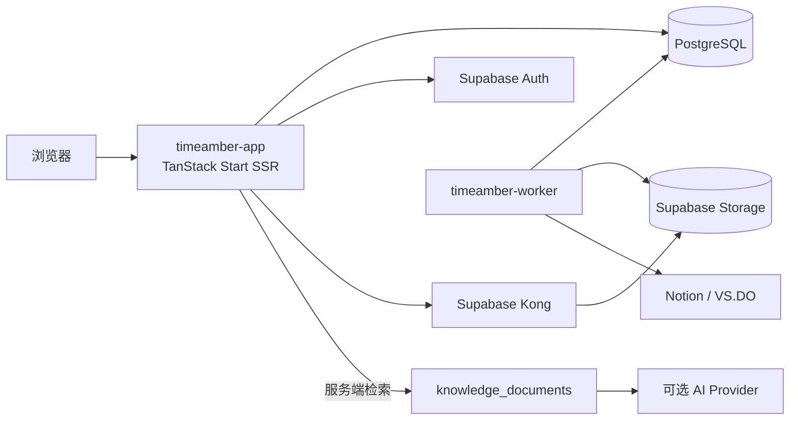

<div align="center">


# TimeAmber

**时光成珀，字字如初**

[](https://tanstack.com/start)
[](https://react.dev)
[](https://tailwindcss.com)
[](https://supabase.com)

</div>

TimeAmber 是部署在群晖 NAS 上的个人博客、剪藏归档和内容管理系统。项目使用
TanStack Start 构建前后台，数据、认证和媒体由自托管 Supabase 提供，独立 worker
负责 Notion、web-archive（VS.DO）、备份和定时任务。

生产站点：[timeamber.com](https://timeamber.com)

> 当前 `main` 分支同时包含公开站点、管理员后台和同步 worker 的生产代码。
> 公开端重点保持阅读路径短、首屏信息清晰；后台重点保持数据加载可见、搜索与切换不阻塞；
> 生产部署使用同一套 Docker Compose 项目运行，避免应用、worker 和自托管 Supabase 产生多套状态。

## 项目定位

TimeAmber 不是只展示文章的静态主题，而是一套围绕「写作、剪藏、归档、检索和维护」组织起来的
个人内容系统：

| 使用场景 | 入口 | 说明 |
| --- | --- | --- |
| 公开阅读 | `/`、`/posts/:slug` | 服务端渲染文章、分类、标签、归档和友链，支持亮暗主题与阅读辅助 |
| 内容管理 | `/admin` | 管理文章、分类、标签、媒体、设置、同步、备份、审计和诊断 |
| 内容导入 | `timeamber-worker` | Notion 增量同步、VS.DO/web-archive 导入、历史索引补全和备份 |
| 站内问答 | `/admin/ask`、可选 `/ask` | PostgreSQL 检索私有内容，再调用服务端配置的 OpenAI-compatible Provider |
| 自托管运行 | Docker Compose + Supabase | 数据、认证、Storage、数据库和应用均可部署在 NAS 或单机服务器 |

项目的核心边界是：浏览器只拿到公开内容或当前会话允许的数据；服务端密钥、管理员会话、
同步令牌和 AI Provider Key 不进入前端构建产物。

## 功能

- **首页**：品牌 Hero（实时文章 / 标签 / 分类统计）→ 首篇文章编辑型主卡（16:7 封面）
  → 其余文章的 80×80 可选缩略图双列列表 → 页脚；服务端直出，保留紧凑阅读路径
- **响应式导航**：桌面端居中导航与搜索 / RSS / 后台 / 主题图标，移动端使用 300ms
  侧滑抽屉，包含完整导航、搜索、后台与主题切换
- 文章、归档、分类、标签、友链页
- **文章页阅读辅助**：面包屑、目录、阅读进度条、字号行高调节、代码复制、图片放大、
  图片懒加载、匿名点赞、分享、上一篇 / 下一篇、最多 6 篇相关文章
- **内容发现**：分类卡片使用琥珀 / 蓝 / 绿 / 橙 / 紫五色边条；友链使用带图标、简介与
  可选分组标签的 1 / 2 / 3 列响应式卡片
- **剪藏快照外壳**：`/cdn/` 下的离线 HTML 会在正文前插入本站标注条
  （品牌入口、剪藏日期、原文外链、"样式未改动"说明）与右下角返回胶囊，
  见 `server/clip-shell.mjs`
- **服务端 Markdown 渲染**：GFM（表格、任务列表、脚注）+ Shiki 语法高亮 + rehype-sanitize，
  代码块外框与复制按钮由服务端直出，客户端只做事件委托与图片放大
- **⌘K / Ctrl+K 全站搜索**：一次命中文章、分类与标签
- **后台体验**：全局文章 / 标签 / 分类搜索、琥珀侧栏选中态、引导式空状态、明确的红色
  危险操作，以及已有的键盘导航快捷键
- **分类页** `/categories`：按文章数排序的分类卡片与标签云，支持 `?c=` / `?tag=` 筛选
- **归档按年折叠**，避免上千篇文章一次铺开
- **sitemap.xml 与 RSS**：sitemap 覆盖全部已发布文章（带 lastmod），RSS 输出最新 50 篇
- **SEO head**：canonical、Open Graph、Twitter Card、`article:published_time`，
  描述统一去除 Markdown 语法
- Supabase Auth 管理员登录与 HttpOnly 加密会话
- Markdown 文章和 HTML 跳转文章
- Notion 数据源增量导入与图片修复
- NAS web-archive / VS.DO 增量导入
- Supabase Storage 媒体库、同源媒体代理和上传
- 自动备份、保留策略、通知、运行诊断和审计记录
- PostgreSQL advisory lock，防止自动任务与手动任务并发写入
- 自定义品牌图、favicon、默认文章首图和本地字体

## 架构

```text
Internet
  |
  v
timeamber.com
  |
  v
timeamber-app :49287
  |-- TanStack Start SSR / Admin
  |-- /supabase/storage/... -> Supabase Kong
  |
  +--> timeamber-worker :3001
  |      |-- Notion sync
  |      |-- web-archive sync
  |      `-- backup jobs
  |
  `--> Supabase
         |-- PostgreSQL
         |-- Auth
         |-- PostgREST
         |-- Storage
         |-- Realtime
         |-- Studio
         `-- Kong
```

NAS 项目目录：

```text
/opt/docker/timeamber
```

应用容器与 Supabase 使用同一个 Compose 项目和网络。生产应用映射
`49287:3000`，Supabase API 只绑定本机地址，不应直接暴露到公网。

生产服务边界：

| 服务 | 容器端口 | 作用 | 公网策略 |
| --- | --- | --- | --- |
| `timeamber-app` | `3000` | TanStack Start SSR、静态资源、后台和媒体代理 | 只通过反向代理/隧道对外，主机映射为 `49287:3000` |
| `timeamber-worker` | `3001` | Notion、web-archive、知识索引和备份任务 | 不直接发布到公网，仅由 app 在 Compose 网络内调用 |
| `supabase-kong` | `8000/8443` | Auth、REST、Storage、Realtime 等 Supabase API 网关 | 绑定内部地址；公网访问应经过受控代理 |
| `supabase-db` | `5432` | PostgreSQL 数据库 | 仅 Compose 网络内访问 |
| `timeamber-migrate` | — | `tools` profile 下执行迁移或恢复 | 一次性工具，不作为常驻服务 |
| `timeamber-cloudflared` | host network | 可选 Cloudflare Tunnel 出口 | 只读取 tunnel 配置，不承载应用数据 |

### 请求与数据流



- 公开文章、归档、分类和标签主要由 `timeamber-app` 直接从 PostgreSQL 读取并服务端渲染。
- 管理员登录通过 Supabase Auth 完成，TimeAmber 服务端再建立 HttpOnly 会话；管理操作不会把
  service role key 下发给浏览器。
- 媒体统一走 `/supabase/storage/...` 的同源代理路径。应用只需要访问内部 Kong，浏览器不需要
  连接 NAS 上的旧媒体目录。
- worker 通过数据库和 Storage 写入导入结果，`sync_runs`、审计和诊断表为后台提供可追踪状态。
- Ask TimeAmber 先在 PostgreSQL 的 `knowledge_documents` 上检索，再由服务端调用 AI Provider；
  AI Key 不参与浏览器构建，也不写入静态 HTML。

## 性能与交互策略

最近的前后台整理围绕两个实际问题展开：打开文章时尽量提前准备路由资源，进入后台时避免把
所有数据和搜索计算集中在一次同步渲染中。相关代码仍保持在页面组件和共享数据层内，方便继续
定位与回归：

| 区域 | 当前策略 | 维护提示 |
| --- | --- | --- |
| 首页 | 第一篇文章使用编辑型主卡，其余文章保持紧凑列表；缩略图按需加载 | 修改行高、封面比例或首屏间距时，要同步检查不同视口高度 |
| 文章跳转 | 文章卡、归档和相关文章使用 TanStack Router 的 intent preload | 新增文章入口时优先复用同一 preload 行为 |
| 首页动效 | 只给主卡和首屏少量文章添加渐入延迟；非首屏条目不参与大规模动画 | 新增动画应遵守 `prefers-reduced-motion` |
| 全站搜索 | 管理端搜索使用延迟查询值和预计算的文章检索索引 | 不要在每次按键时重新拼接全部文章标题、分类和标签 |
| 后台状态 | 文章、分类、标签等状态分块加载，首屏先展示可用骨架与局部状态，较重数据在后台补齐 | 新增管理页应使用共享 admin store，避免重复拉取同一份全量数据 |
| Markdown | 服务端完成 GFM、Shiki 高亮和 sanitize，客户端只接管复制、图片放大等交互 | 不要把私有文章正文预打包到客户端静态资源 |
| 静态资源 | `server/node.mjs` 对构建资源提供 immutable 缓存，并对可压缩响应支持 gzip | 发布后若页面未变化，先确认浏览器和反向代理缓存，再判断是否构建失败 |

这部分优化的目标是降低点击文章和进入后台时的主线程压力，同时不牺牲服务端直出、键盘操作、
移动端可用性和无障碍的降运动偏好。

## 目录

```text
src/                         TanStack Start 前后台
src/lib/markdown.server.ts   服务端 Markdown 管线（GFM + Shiki + sanitize + 代码块外框）
src/lib/home.functions.ts    首页取数（最新文章、缩略图与实时文章 / 标签 / 分类统计）
src/components/home/         首页区块：文章列表与文章行
src/components/layout/       顶栏、页脚、面包屑、回到顶部、搜索面板、主题切换
src/components/post/         文章页目录与阅读设置
src/lib/feeds.server.ts      sitemap.xml / rss.xml 生成
src/lib/strip-markdown.ts    meta description 与 RSS 共用的去语法工具
server/                      Node 生产入口、静态资源和媒体代理
server/clip-shell.mjs        /cdn/ 剪藏快照的本站外壳（流式注入，不改快照文件）
worker/                      Notion、web-archive、备份任务
supabase/migrations/         数据库结构、RLS 和 Storage 策略
deploy/supabase/             Supabase + TimeAmber Compose
public/brand/                Logo、favicon、PWA 图标和默认首图
public/fonts/                本地字体
Dockerfile                   Web 应用镜像
Dockerfile.worker            Worker 镜像
```

## 视觉系统与主题

TimeAmber 使用 Tailwind CSS v4 的语义 token 统一控制前后台视觉。所有主题颜色都定义在
`src/styles.css` 的 `:root` 与 `.dark` 中，再通过 `@theme inline` 映射到
`bg-background`、`text-foreground`、`border-border` 等工具类。组件不保存独立主题色，
因此换色不会改变路由、内容、数据或交互逻辑。

### 主题切换

站点支持亮色和暗色两种固定偏好：

| 偏好                                                                                 | 根元素状态             | 行为                           |
| ------------------------------------------------------------------------------------ | ---------------------- | ------------------------------ |
| 亮色                                                                                 | `<html class="light">` | 固定使用暖纸主题               |
| 暗色                                                                                 | `<html class="dark">`  | 固定使用暖黑主题，也是默认偏好 |
| 偏好同时写入 `ta-theme` Cookie 和浏览器本地存储。首屏 bootstrap 脚本在样式表与 React |
| 水合前设置 `.light`/`.dark`，避免主题闪烁；切换机制集中在 `src/lib/theme.ts` 与      |
| `src/components/layout/ThemeToggle.tsx`，修改视觉 token 时不应改动它们。             |

### Editorial token

当前主题采用暖纸、暖调真黑、近黑油墨和单一蓝色强调的 editorial 视觉系统：

| Token                  | 亮色                                     | 暗色                                     |
| ---------------------- | ---------------------------------------- | ---------------------------------------- |
| `--background`         | `oklch(0.962 0.006 95)`                  | `oklch(0.18 0.008 95)`                   |
| `--foreground`         | `oklch(0.18 0.008 95)`                   | `oklch(0.94 0.006 95)`                   |
| `--card` / `--popover` | `oklch(0.985 0.004 95)`                  | `oklch(0.23 0.008 95)`                   |
| `--primary`            | `oklch(0.485 0.272 266)`（约 `#1d39f5`） | `oklch(0.621 0.204 273)`（约 `#6175ff`） |
| `--border`             | 暖中性 16% 发丝线                        | 暖白 17% 发丝线                          |
| `--input`              | 暖中性 28%                               | 暖白 30%                                 |
| `--ring`               | 主蓝 55%                                 | 主蓝 60%                                 |

- 全局 `--radius: 0`，普通卡片、按钮、输入框和代码块保持编辑型直角；正文图片按阅读场景
  单独增加 0.5rem 圆角与轻阴影。
- 正文与标题优先使用 Geist / Manrope，并提供 Noto Sans CJK SC、思源黑体和系统中文字体回退。
- 品牌字继续使用 `A Song For Jennifer`；代码继续使用本地 `JetBrains Mono`。
- 正文标题使用 650 字重，h1/h2/h3 行高分别为 1.05、1.10、1.15。
- 边框保持 1px 实线；彩色主色只用于链接、交互状态、焦点环和少量强调。
- 标签胶囊、头像、状态点等明确使用 `rounded-full` 的元素仍保持圆形，不受 `--radius` 影响。

### 琥珀点缀色

蓝色是唯一主色，琥珀只作点缀出现，用来呼应「时光琥珀」的名字而不与主色争夺注意力：

| Token                       | 亮色                   | 暗色                  |
| --------------------------- | ---------------------- | --------------------- |
| `--accent-amber`            | `oklch(0.52 0.13 68)`  | `oklch(0.8 0.14 72)`  |
| `--accent-amber-strong`     | `oklch(0.45 0.14 62)`  | `oklch(0.86 0.15 75)` |
| `--accent-amber-soft`       | 同色 12% 底            | 同色 16% 底           |
| `--accent-amber-foreground` | `oklch(0.99 0.005 95)` | `oklch(0.16 0.01 95)` |

出现的位置包括：首页 Hero 光晕与统计、文章分类胶囊、阅读进度条、目录当前项、归档热力条、
正文引用与行内代码、友链悬停、后台侧栏选中态，以及深色页面顶部 5% 透明度的背景光晕。
亮色档必须压到 `L=0.52` 才够 4.5:1，不要把暗色档那支亮琥珀直接搬过去。新增用途时
先在 `:root`/`.dark` 补׎�����k�w��eQ}MUA	M}UI1����84)�Y%Q}MUA	M}AU	1%M!	1}-e���3�r7�*�����J3�R�Ꟗ��f�����R�����S�j4)�MUA	M}UI1���MUA	M}AU	1%M!	1}-e���MUA	M}MIY%
}I=1}-e����84)�Q	M}UI1���ےⴁ�Y%Q}���>c�?��k��o����?��#�f��z����3�>����R������rÖv�J0��Չ��͡��������������04+��7���R��͕�٥���ɽ�������VÚ6���O�������k��w���J��"[�����'�Z�&3�4(4(����:����7���4(4+��7�"۞���/�Z��ۖB;����g��{�f���3��7���>C�ꐁ����ك�4(4)�����͠4)���������������͔4)������ع�ᅵ��������4)���4(4+�ϦR��7�����h4(4)���>c�<����������������������������R��P�������������������������������������������������������������������������4)��������������������������������������������������������������������������������������������������������������4)���A=MQIM}AMM]=I�������������M�����͔�A��ѝɕME0����������������������������������������������������������4)���)]Q}M
IQ��������������������M�����͔�)]P����J�������������������������������������������������������������4)���9=9}-e������������������������?��#�f��J3�2��B4�A$����J���������������������������������������������������������4)���MIY%
}I=1}-e���������������r7�*��������B���J����������������������������������������������������������������4)���MMM%=9}M
IQ����������������Q������ȁ!���=��䃒�k��w�*�����������������������������������������������������4)���Q%55	I}M
IQ}-e���������������'�Z�7����*������������������������������������������������������������������4)���]=I-I}M
IQ�����������������������R��ݽɭ�ȃ�j����&Ӛv���������������������������������������������������4)���MUA	M}AU	1%
}UI1����������������M�����͔��~랆�rÖv�������������������������������������������������������4)���1
e}5%}AQ!�������������9L��:�>˖�K��O�n���T�������������������������������������������������������������4)���9=Q%=9}Q=-9������������������9�ѥ����n�"C�&0��������������������������������������������������������������4)���9=Q%=9}Q}M=UI
}%���������9�ѥ����VÚ6���@�%�������������������������������������������������������������4)���YM}=}	M}UI1����������������ݕ���ɍ��ٔ��r7�*��rÖv���������������������������������������������������������4)���YM}=}Q=-9�������������������ݕ���ɍ��ٔ�A$��&0���������������������������������������������������������4)���%}	M}UI1�������������������=���$������ѥ����A$��~랆�rÖv��#�>�����d����ŀ��"[��3�VЁ
��Ё
�����ѥ��̃�rÖv��$��4)���%}A%}-e��������������������ͬ�Q������ȃ�r7�*�����A$�-�䀀�����������������������������������������������4)���%}5=1����������������������ͬ�Q������ȃ����R��j����z/�B7����������������������������������������������������4)���-9=]1}%9a}	Q
!}M%i����ݽɭ�ȃ��?�&碆����ݕ���ɍ��ٔ��~����ҋ��W�j�Væ?��3��c��������������������������������4(4)�%}A%}-e���>��Σ����ѥ������ȵ������j��C��3�^۞:�����3��7�b������ȁ�ե����ɟ��3����7������R�4)�Y%Q}���&7����r��7����$�Aɽ٥��ȃ�^۾�1ͬ�Q������ȃ��k�b����r��7����*ۚ��3��g�
�ے�[�*���������C��3�4(4(������C��3�^ۦ7������V04(4+�R�꜁
����͔���k�*+�B3���������ـ��>c�?����6�����7�B3���f��r���j��C��3�^ۖ>c�?��h4(4)����C��3�v�������>c�<�����Ӛb8��4)�������������������4)����?��#�f��z������Y%Q}MUA	M}UI1���Y%Q}MUA	M}AU	1%M!	1}-e�����>��2�B������M�����͔��rÖv�J0��Չ��͡��������������4)���ѥ������ȵ��������A=IQ���Q	M}UI1���MUA	M}UI1���MUA	M}AU	1%M!	1}-e���MUA	M}MIY%
}I=1}-e����MMK��VÚ6���O���>[��Ѡ���k��w�MѽɅ����B�J3����B�Fc�N7��p��4)���ѥ������ȵ��������MMM%=9}M
IQ���Q%55	I}M
IQ}-e���]=I-I}UI1���]=I-I}M
IQ������k��w�*���������'�Z�7����*����J0�����ݽɭ�ȃ����&Ӛv��4)���ѥ������ȵݽɭ�ɀ����Q	M}UI1���5%}I==Q���	
-UA}I==Q���	
-UA}9	1���	
-UA}IQ9Q%=9�����VÚ6��B3������K��O�Z��ۖJ3�������w�Vg��[�V���4)���ѥ������ȵݽɭ�ɀ����Me9
}9	1���9=Q%=9|����YM}=|����-9=]1}%9a}	Q
!}M%i�����������*��J3�~����ҋ��W�������o�r��7����v���C�^۞n��S���*���7��S�B��R���4)��M�����͔��r7�*�����A=MQIM|����)]Q|����9=9}-e���MIY%
}I=1}-e�����VÚ6���O��ѣ�A$��ѕ݅䃖J0�MѽɅ����j��W���7�����4(4+���n���W�R�꜁
����͔�����R���9=9}-e����g��S�R��b����"@4)�MUA	M}AU	1%M!	1}-e���o����v_�2[����v����ז���B3���ꛖ�k�����R�:����>c�?�B7�^۾�3�����B3�^ۚ��~�4)������ȵ�����͔�嵱���������������͔������ȵ�����͔�ѥ������ȹ嵱������ə�����j��ե����ɝ�4+�>(���Ɍ���ѕ�Ʌѥ��̽������͔������й�̓��3�B��"g�>�����:Ês�r7�*������������?��#�f��������D�M�����͔��7����w�j4+�"���*ۚ�4(4(���ͬ�Q�������4(4)ͬ�Q������ȃ��7��;����B�Fc�B;�>�����������ͭ���3��7�R��:Úr$�M�����͔��Ѡ���8�!���=��䃞���B�Fc��k��w�4+����7��k�*+����뚶��Z�g������"ߞ���vg��Z��۾�o��?��#�f��>��Rۖ"Úr��#�n{��S�J3�r'�fC�j�v���C�Fc���4(4(�����&7�>Ö��R���#��c����Ϧ^���$4(4+�&7�>�����ͭ���>C��o�B3����_�^���S���*o��3������c�����7��疒X����3���ϖr����������͕�ѥ��̀��j�3�&7�>Ö*���7�2�v\4+��!�͕�ѥ��̹�ͭAՉ������������'��Ϧ^��^ۖ&7�>æ�צv��>��b����3��g��^���S�j�r����R��7��3���"��3����7��k��:Ö��>��4(4+���R��B;��?����>C�^�����k��#�_�&�7����j��%}A%}-e���3�n�����������"C�r��^�^���h4(4(������g��ӖꛦfC����k��?�"�J|�؃������?�������������#��g�"C�r����⫞����+�fC��'�4(���^���c�V��ꘀˊL�������_�4(�����ҋ��;��s��S���G��;�B;�>Þ&#��3�����Ӿ�3�ʇ�r'��ϖ����Zg�^ۖB3��ߒ�7��k��[���4(4+��/�&�b�����g�fC���3��7�b��2$�%C��k��g�
����˖r��>7�BG�B��j��O��/�B;��3����>G��Ӗ>������04+��;�ۖk���⫢������W���j�2$�%@��fC����3��7���*+�����^�^��R۞ҟ�4(4+���ҋ������R��:Úr$�A��ѝɕME3��h4(4(���ͥ������ձ��Q��ЁM��ɍ����8����}�ɝ�����ߖB#�:K��?��3��7��W����w��[�BG�?�VÚ6���O�4(����Չ�������ݱ����}���յ���̀����B��I1O��3������B�Fc�>����>[�4(���6k����Z����J0�9�ѥ�������Rā�����̀�����>G�f���{�?�nӚZÞҋ��W�4(��ݕ���ɍ��ٔ��B3����^ے�;������!Q50��>C�>[�>�����Z��ۖ�{�?�g���ҋ��W�4(������ݱ���������ခݽɭ�ȃ���*��>��������떒Ǟj�:�>˖�K�����3��7��k�r���?����B��*��^ۖ��?�7���4(4+��S�R��Z�����Ʌѥ����B;��3�>��r��ͬ�Q������ȃ��צv�������:�>˖�K�����3�"[�k���>\��]=I-I}M
IQ�4+��w�*��j�ݽɭ�ȃ���>���C��0�����ݱ���������ဃ���*���&�r'�n{��S�j�M��ɍ�̃���v�����{�f���ҋ��O�zs��o�ʇ�r'��ϖ�|4+���Zg�^ے�7��k���R�����z/��[����S��#�4(4+����B�Fc�����k���M�����͔��Ѡ�����B��3��7�g����O��O�"X�
����͔��Z��ێ4(4(������>C�ꓒ�;�>G��4(4+��뢺��*+���>c�nӎ����˦7����J3��C��3�^ۚVÚ6��"�����B��>C�ꓖ&7�ϖ�G�&���3��h4(4)�����͠4)��Ё�х��̀��͡���4)��Ё������������4)����ѕ��4)�����͌��������4)�����ո�����4)�����ո��ե��4)���4(4+�>C�ꓚ^ۖ>��*����r�����b;�����3�����j�Z��۾�h4(4)�����͠4)��Ё����I5�����Ɍ��ݽɭ�ȼ�͕�ٕȼ�͍ɥ��̽��м�����ə��������ə����ݽɭ��)��Ё�����������������х�4)��Ё���������������������4)��Ё�����Ѐ������͍ɥ���ѡ���������)��Ё��͠��ɥ�����ɕ٥�ݕ���Ʌ����)���(+�v��BG�R�꟞j�>c�nӖ�뢺��#�:���"Þ.���/������"�R���3�7�B#��ۖ"����������o��7����;�R�Ꟛr�nӚ:��>C�꓾�0+����7���R����"ۚ:�����n[��s����:�>ˎ�B#��ۖ&7�r����w�Vg�>��n{��k�j�>C�ꓖ>ߖJ3����S�j��3���*��F+�(+��7���n����>G����S�R��3���&/�>C�ꓒ�/�����h(4(������ك��������������͔����ك�
��Ց���ɔ��չ�������6��9�ѥ���YL�<�$���!Ո�ѽ�����l4(��A��ѝɕME0��յÎ��K��O��O��������������͔�ٽ�յ�̼����ⷞj�VÚ6���O�J3��C��3�^ۚVÚ6���l4(���⛚r'�r��r��w���޿�����Ӛ^ۢ����n���W�"X�9L���O�R�����>��j�
����͔����n[�Z��۾�l4(����;�r�������^��Ϟj�������z���^���_�J3�R�Ꟛr�ޗ��s�2�R�*��4(4+���zs��S�R��b��RǞR�Ꟛr��+�j��Ѓ�ޗ��s�2랺��B��3�#�r��r��rÖ�3�"C���~���ۚ:����3�7�r��R�Ꟛr�&���04)���Ё�ձ����������僎�R�Ꟛr떶c�r��r��>C�ꓖ>c�nӚ^ۖ�S�#��w��c�޻���J3��O�&7�>C�ꓖ>߾�3��7���R����"ۢ��n[�j�Z��<4+�B3�����O��O�4(4(���9L������4(4+�R�꟞n���W��聀���н�����Ƚѥ������Ƀ��>G���&7�#�������ޗ��s�2�ʇ�r'��k������n[�j�r��rÚR�*���04+��w��c��O�&7�>C�ꓖ>߾�3��ۖ������C����;�VÚ6���O��R�Ꟛr떚�zs�k����Ѓ����B��C����3��S����R�4)���Ё�ձ����������倃�nӚZÖ�˖�����j�>G���"�R���o���zs����R��>G���2��3�"g�>��n��6��>_�&#�r��:��"۞j��C����04+��w�Vd�����ك��������������͔����ك���K��O�������J3�VÚ6���O�6ߎ4(4(������{�?�>G�����6T(+��S�R��>G���&7�2'��/�v�����?�&���3��3����W�������Ǣҗ���s�r���O�&7�&#�r���3��7���"��f����f���VÚ6���O�6ߚ"[��K��O��h((ĸ���Ö�W��O�&7�>C�ꓖ>߾�3��w��c�R�Ꟗޗ��s�2�޻����3��ۖ������C����VÚ6���O�J3�ϦR���C��3�^ۚVÚ6��(ȸ��>��nӚZÖ�˖�����j�>C�ꓚ"[�>G���"�R���3����R�����Ё�ձ����������僾�3�������ʇ�r'�?��[�j�r��rÚR�*��(̸��&���0�������ȁ�����͔�����ص��������؀��������ȵ�����͔�嵰�����������ե�у��3�������
����͔(�����W���7����r'�V#��P�����ـ��ʇ�r'������n[�(и����7���>G�R�>c�2[�j�r7�*���o�f��h�]����>c�nӖ>��7��聁ѥ������ȵ������3��7�����&/�7�B��ݽɭ�ˎ(���M�����͔��"X�
��Ց���ɔ��չ����(Ը��k���r��r���>���>7�BG�B���>��J3��?��#�f��K����~��B;��3�7�*+�>G���>C�ꓖ>ߢ�Ö�W�"æ���˚^���_�(+�.���3�Rۖ�Ǣҗ��3�#��w�Vg��Ǣҗ�^���_�J3��O�&7�Vs�?��3�7�n{�"Ö>G���&7��Ö�W�j�^��>C�ꓦ7�ZÚz��聁ѥ������ȵ����+��ۚ&���3�n�B3�j����ߚ��~���n{��k�>��"�6��>_�&#�r��:��"۞j��C���"[�Vs�?��3��7�"��f��VÚ6���O�6ߎ��K��O�6ߎ�����+�J0�����ك��m���Ʌѥ����j�n{��k�����>���3����þ�3��7���*+��S�R��n{��k�����O�"C�VÚ6���O�n{��k�(+�>G���&7���~���h(4)�����͠4)������н�����Ƚѥ�������4)��Ё�х��̀��͡���4)��Ёɕص���͔�!4)���4(4+�꼁
MO��&7����"[�r7�*�����]����R�*��>��r���7��聁ѥ������ȵ������3��7���7�B��ݽɭ�ȃ�"X�M�����͗��h4(4)�����͠4)������н�����Ƚѥ�������4(4)�����ȁ�����͔�p4(������ص��������؁p4(����������ȵ�����͔�嵰�p4(���ե���ѥ������ȵ���4(4)�����ȁ�����͔�p4(������ص��������؁p4(����������ȵ�����͔�嵰�p4(����������������́ѥ������ȵ���4)���4(4+��O�&7�R�Ꟗ��f��j�
����͔�ݽɭ������ɕ�ѽ�䃖J0��������������"�"��b�4)����н�����Ƚѥ������ɀ���;���n���T�������ȵ�����͔�嵱���o��{�?�>G����������R���g�����n���04+���7�"o��랲���3��_�B3�B7���f��	�������������͔������ȵ�����͔��嵱���b�����v_�2[�j�ZÞ:�������˚���v���04+��7�R���;�n��6���ˢ�C��3�j���
����͔����n��4(4+�>��r$��ݽɭ�Ƚ�������ə����ݽɭ�ɀ��"X�ݽɭ�ȃ��w��[�>G�R�>c�2[�^۾�3�&7����*��z���J3�nӚZ�4)�ѥ������ȵݽɭ�Ƀ��VÚ6���L����Ʌѥ�����������R���/�Z�.���/�j�ѽ��́�ɽ������3��7���k���f��h4)]����>G���jC��?�&���3�4(4+�~��r/�*ۚ��h4(4)�����͠4)�����ȁ�̀�����ѕȁ�����ѥ�������4)�����ȁ������Ѐ����ɵ�Ѐ���Mхє�!���Ѡ�Mх�������ѥ������ȵ���4)�����ȁ���̀��х�������ѥ������ȵ���4)��ɰ����������͡�ܵ��ɽȀ�����������輼��ܸ����������ܼ4)��ɰ����������͡�ܵ��ɽȀ������������輽ѥ������ȹ����4)���4(4+�R�꟦�3�Rۢϖ�G���n[��k��[��זJ3�����Z�����껚j_��力c�"�6�����*������[��?��b��_�>ߚ:��"ێ��?��#�f�4)���ͽ����3�>+�vg�����C�b��B��v����ZÚz������f��*ۚ������聁����ѡ僾�3����G��;�r��r���>�����S��S�nx4(����ⓒ⫞R�Ꟗ��f����7���������ߚ��~��J0��ɕ�х���չ���̵�ѽ������4(4(����VÚ6���O�"w��/�2X4(4+��[�������˚^ۢ�C��3������h4(4)�����͠4)������н�����Ƚѥ�������4(4)�����ȁ�����͔�p4(������ص��������؁p4(����������ȵ�����͔�嵰�p4(�����ɽ�����ѽ��́�ո���ɴ�ѥ������ȵ���Ʌє4)���4(4+������k�"o���Z�����"����������2��B7��K�*����K��O��B3�����Ö�W��7������������k�~��J3��+�Z������04+��ۖB��R��I1O��g���N7��s�>����㞺��B�Fc�"X�͕�٥���ɽ���4(4(������*�����4(4+�R�꜁ݽɭ�ȃ����R���Me9
}9	1���Օ��4(4(��9�ѥ�����{�?�B3�����k���>[��w��c�j����ͽ˾�3�"�&疒�B��צv�4(��9�ѥ���ɕ���˾�k����g����Z�n��&�J3��떒ǖ�_���4(��ݕ���ɍ��ٗ��k�2'��ע��>X�YL�?��3����R���ͽ�ɍ����ͽ�ɍ�}�����:�44(���&�r'���*��g�����Չ�����幍}�չ̀4(����٥ͽ�䁱�����b˚���B3�����*���ۖ>G�&���04(4+�B;�>Ö>��r��s�������;�B3����w�ⷚ~��r/�*ۚ��ۚ&/�*�����>G��F���3��+�Z���h4(4)�����͠4)�����ȁ�ᕌ�������͔������Ű��T����ѝɕ̀������ѝɕ̀���p4(���͕���Ѐ���ɽ���Չ�����幍}�չ́�ɑ�ȁ�䁥����͌�����Ѐ���4)���4(4+��:�����ɕ����չ��������������*����*���;�&/�*����*��7�>���3�R��˦b��7��7�g����o��'����O�&44+���*���O�v�B;��3��/���F��r��k��C��3�4(4(�����K��O��L4(4+��K��O���Ƈ��c�R��r��M�����͔�MѽɅ����j����������Ս��ӎ�VÚ6���O�>���w��c��g��n㖾�rÖv��h4(4)���ѕ��4(�������͔��ѽɅ����Ľ�����н�Չ����������񽉩��е��Ѡ�4)���4(4+��S�R��r7�*��f��*+����޿���B�"Ö���M�����͔�-�����3�n������?��#�f���7��w��X�9L��j�^�����#����>��4+�B;�>Ö�K��O��O�"���*�����r��D������v���Ö�W��3��V��n�����R��K�*����������������J04)����ѕ�е٥ͥ�����僾�3���7������&O����צv��B3�^ۢ��>[����?�Z��ێ4(4+���~���K��O�VÚ6���h4(4)�����͠4)�����ȁ�ᕌ�������͔������Ű��T����ѝɕ̀������ѝɕ̀���p4(���͕���Ё��չР����ɽ���Չ���������}�ѕ���4)���4(4(����N�&3����@4(4+�N�&3�Z��ے�7��8���Չ�����Ʌ������h4(4(���ѥ������ȵ�����������k��3�VЁ1���4(���ѥ������ȵ����ձе��ٕȹ������k�Z�����c�����[�n���0��������4(�����٥������������٥��������ع��������٥��������ȹ����4(���������ѽՍ�����������4(����������ȹ�������������ȹ����4(4+�r��rÖ�_��O��7��8���Չ��������̽���3�Rā��Ɍ���展̹��̀��j�����е��������W�R���3��7��w��[��Ӛ^�4+�"[�����'�Z����C�rÖv�4(4(����������;�n{��h4(4+����˖&7��뢺��������C���J3�VÚ6���O��h4(4)�����͠4)хȀ���፱Ց������}���ձ�̀���፱Ց�����Ѐ���፱Ց��������������͔����؁p4(����阁������̽ͽ�ɍ������є���d������ �4�L��хȹ�耸4(4)�����ȁ�ᕌ�������͔������}�յ���T����ѝɕ̀������ѝɕ̀���p4(����������̽���ѝɕ̴����є���d������ �4�L���յ�4)���4(4+�n{��k��S�R��^ۖ"�6��"Ò�+���Vs�?�"[����7��C���������3�7�&���0�
����͔����������VÚ6���O�n{��k�&44+�����#�s���������J0�ݽɭ�˾�3���7����7����/�ⷞg���4(4(����:K�jp4(4(������G��g�&O����4(4)�����͠4)��ѥ��4)�̀��������������ха���԰������ѥ���������ɝ̀��ͽ�������ԁ������4)�����ȁ�х�̀�������ɕ��4)���4(4+�7�
�2�"�
AT��������;���n`�$�?���7���nӚ:��v���R��S��7�b;�j����f[�����r7�*��"[����"K���*��4(4(������K��O�^���W�b����4(4+�������UI0����������͔�������Ӿ�3��ۚ��~���h4(4)�����͠4)��ɰ��$�p4(������輼��ܸ����������ܽ������͔��ѽɅ����Ľ�����н�Չ����������񽉩��е��Ѡ�4)���4(4(�������*�������ǢҔ4(4)�����͠4)�����ȁ���̀��х�������ѥ������ȵݽɭ��4)�����ȁ�ᕌ�������͔������Ű��T����ѝɕ̀������ѝɕ̀���p4(���͕���Ё����ͽ�ɍ�}��䰁�х��̰���ɽȁ�ɽ���Չ�����幍}�չ́�ɑ�ȁ�䁥����͌�����Ѐ���4)���4(4(�����f��W��ǢҔ4(4+����B�Fc�қ�>ߖr�����Ѡ��͕�̓��3��K�&˖r����Չ�����ɽ����̓�����R��M�����͔������A$��7���4+������3��7���nӚ:��g�b;�Z�"[�&/�ޗ����R䁁������ѕ�}����ݽɑ��4(4(�����'��4(4(������ك��&3������J3�VÚ6���O�������7��_�>C�ꐁ��4(��͕�٥���ɽ����>��R���;�r7�*����4(������B��k��w����R��!���=��䁍�����4(�������'�Z�7�������R���Q%55	I}M
IQ}-e���*���4(������G�>��>G����S�R��>7�BG�B���>�4(����k�r���~����f�����ߎ�B3�����Ǣҗ��Ö�W�J3������>�����7��4(